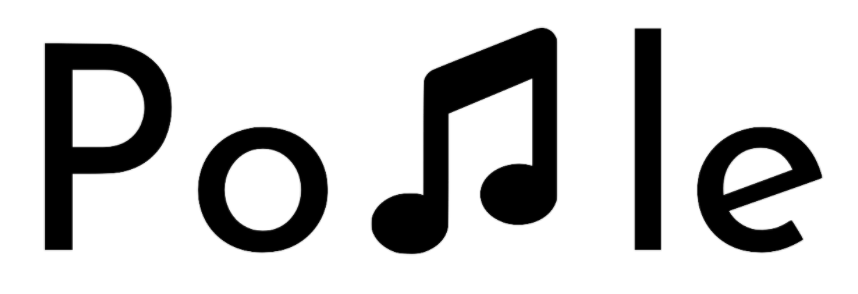
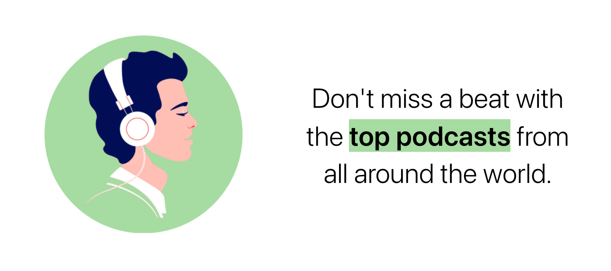
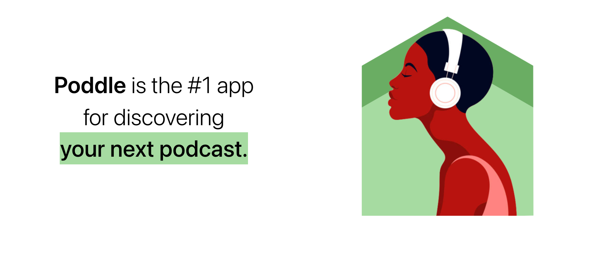

<div align="center">
  
</div>

<h1>
  <p align="center">
    Created by Blake Eriks 
    <a href="http://twitter.com/be_lockay">
       </img>
    </a>
  </p>
</h1>

[Poddle🎧](https://poddle.netlify.app/) is a podcast discovery platform that works in 3 easy steps:

>⬆️ Sign up.
>
>📚 Pick your favorite genres.
>
>🔎 Explore awesome podcasts.



## 📡 Technologies

### Frontend

* ReactJS
* TailwindCSS
* Netlify Deployment

### Backend

* Ruby on Rails
* Listen Notes API
* Heroku Deployment



## 🛠️ Installation Steps

1. Clone the repository

```bash
git clone https://github.com/BlakeEriks/poddle.git
```

2. Change the working directory

```bash
cd poddle
```

3. Install dependencies

```bash
npm install
```

4. Create `.env` file in root and add your variables

```bash
REACT_APP_API_URL= YOUR_API_URL
```

5. Run the app

```bash
npm run start
```

## 🔥 External APIs

* [Listen Notes](https://www.listennotes.com/)

## 📝 Planned Features

* Reinstate podcast search functionality
* Improve home page with quotes + attention grabbers
* Improve footer